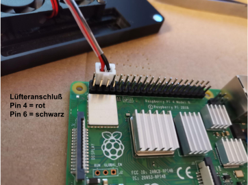

=== Montageanleitung (Raspberry Pi 4 Modell B)

==== Quellen

* https://www.youtube.com/watch?v=aV6cQ226wak

==== Kühler ankleben

==== Lüfter anschließen
Rotes Kabel an Pin 4 der GPIO Schnittstelle (5 Volt +)
Schwarzes Kabel an Pin 6 der GPIO Schnittstelle (Ground)
